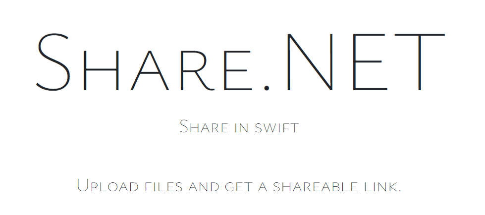

 *Share.NET* , a Web application built using the MERN stack and Vite. 
 
Share.NET allows users to upload multimedia files and provides them with a shareable URI to easily share those files with others. 

# Generating Shareable URIs
After a successful upload, Share.NET generates a unique shareable URI for each file. This URI can be copied and shared with others, allowing them to access the uploaded file directly. The shared files can be accessed by anyone who has the URI, even if they are not registered users of Share.NET.

# Uploading Multimedia Files
Share.NET provides a user-friendly interface for users to upload multimedia files. Users can select files from their local machine and initiate the upload process. Supported multimedia file types include images, videos, audio files, and documents.

# Getting Started
To get started with Share.NET, follow these steps:

# For local environment 
- Clone the Share.NET repository from GitHub.
- Install the necessary dependencies by running ```npm install``` in the project directory.
- Configure the environment variables required for the application, such as the database connection details and any necessary API keys.
- Start the frontend ```(https://localhost:5174)``` using ```npm run dev```. This will launch both the frontend vite server.
- Start the backend server ```(https://localhost:6969)``` using ```npm run dev```. This will launch both the frontend vite server.

## Getting Started With Vite

First, run the development server:

```bash
npm run dev
# or
yarn dev
```

Open [http://localhost:5173](http://localhost:5173) with your browser to see the result.

You can start editing the page by modifying `/src`. The page auto-updates as you edit the file.


## Deploy on Vite

Building the App
You may run npm run build command to build the app.


```bash
 npm run build 
 ```
By default, the build output will be placed at dist. You may deploy this dist folder to any of your preferred platforms.

## Testing the App Locally
Once you've built the app, you may test it locally by running npm run preview command.

```bash
npm run build
npm run preview
```
The vite preview command will boot up a local static web server that serves the files from dist at http://localhost:5173. It's an easy way to check if the production build looks OK in your local environment.

You may configure the port of the server by passing the --port flag as an argument.

```json
json
{
  "scripts": {
    "preview": "vite preview --port 8080"
  }
}
```

Now the preview command will launch the server at 
```http://localhost:5173```.
